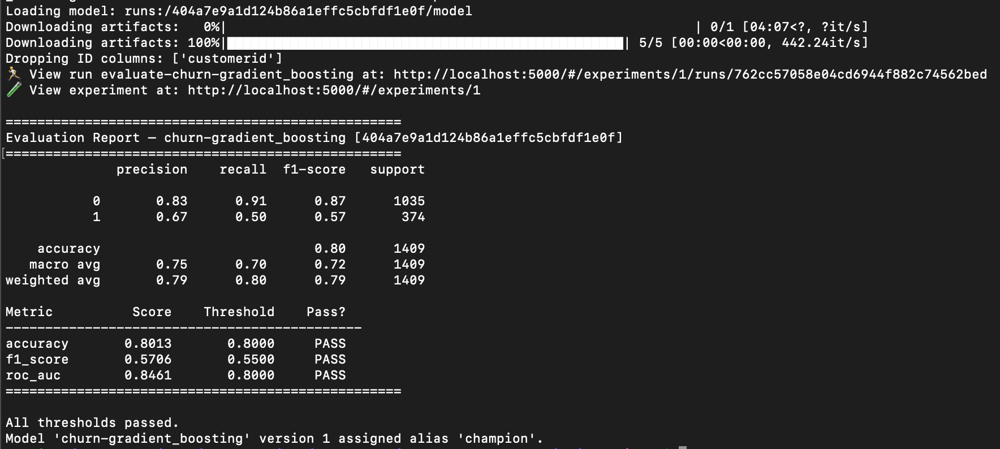
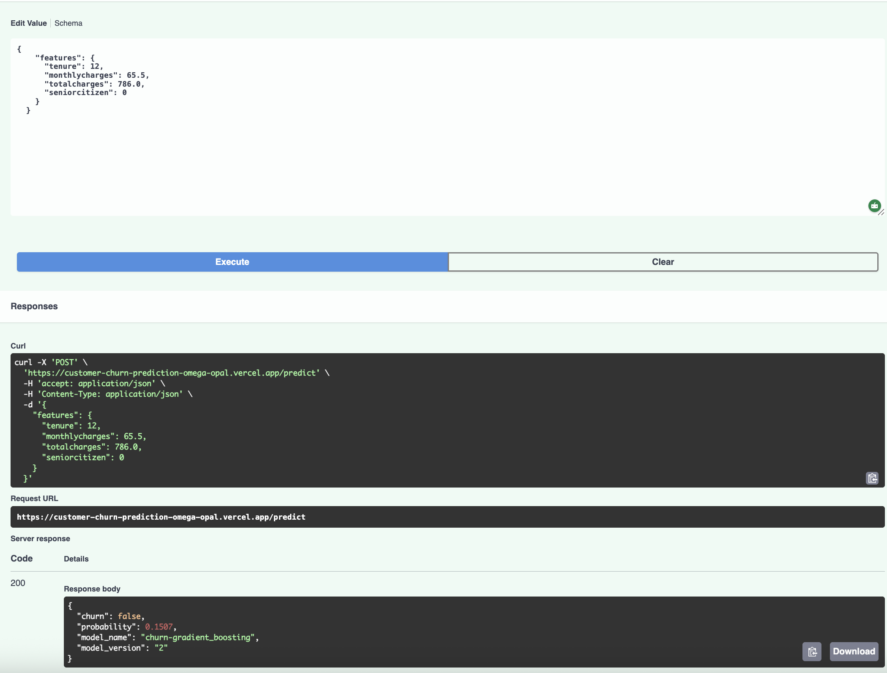

# Customer Churn Prediction

End-to-end ML deployment: **MLflow** for lifecycle management + **Vercel** for production API.

**Live API:** https://customer-churn-prediction-omega-opal.vercel.app
**Swagger UI:** https://customer-churn-prediction-omega-opal.vercel.app/docs

---

## Architecture

```
CSV → SQLite → Train (MLflow tracking) → Evaluate (threshold gate) → @champion → Export → bundle/ → Vercel (prod)
```

---

## Project Structure

```
customer_churn_prediction/
├── data/                    # Drop your CSV here (gitignored)
├── bundle/                  # Exported model artifacts committed for Vercel
│   ├── model.pkl            # Champion model (108 KB)
│   ├── feature_cols.json    # Feature column names
│   └── meta.json            # Model metadata (name, alias, version, run_id)
├── notebooks/               # Exploration
├── src/
│   ├── setup_db.py          # Load CSV into SQLite
│   ├── preprocess.py        # Data preprocessing pipeline
│   ├── train.py             # Train models + log to MLflow
│   ├── evaluate.py          # Evaluate + assign @champion alias if thresholds pass
│   ├── export_model.py      # Export champion model from MLflow into bundle/
│   └── register_model.py    # Manual alias assignment by run ID
├── api/
│   ├── index.py             # FastAPI app — loads from bundle/ (no MLflow at runtime)
│   └── requirements.txt     # Lightweight serving-only dependencies
├── vercel.json              # Vercel deployment config
├── .env                     # Environment variables (gitignored)
└── requirements.txt         # Full development dependencies
```

---

## Full Pipeline

### 1. Setup

```bash
pip3 install -r requirements.txt
# Edit .env with your MLflow URI and dataset config
```

### 2. Load Dataset into SQLite

```bash
python3 src/setup_db.py --csv data/WA_Fn-UseC_-Telco-Customer-Churn.csv
# Creates data/churn.db with a 'churn' table (7043 rows, 21 columns)
```

Set the target column in `.env`:
```
TARGET_COL=churn
DB_TABLE=churn
```

### 3. Start MLflow Tracking Server

```bash
mlflow server --host 0.0.0.0 --port 5000
# UI available at http://localhost:5000
```

### 4. Train & Track Experiments

```bash
python3 src/train.py
```

Trains 3 models and logs all runs to MLflow:

| Model | Accuracy | F1 | ROC-AUC |
|---|---|---|---|
| Random Forest | 0.78 | 0.52 | 0.8203 |
| **Gradient Boosting** | **0.80** | **0.57** | **0.8461** |
| Logistic Regression | 0.77 | 0.55 | 0.8028 |

### 5. Evaluate & Promote to @champion

```bash
python3 src/evaluate.py --model-name churn-gradient_boosting --run-id <RUN_ID> --promote
```

**Output:**



```
==================================================
Evaluation Report — churn-gradient_boosting [<RUN_ID>]
==================================================
              precision    recall  f1-score   support

           0       0.83      0.91      0.87      1035
           1       0.67      0.50      0.57       374

    accuracy                           0.80      1409
   macro avg       0.75      0.70      0.72      1409
weighted avg       0.79      0.80      0.79      1409

Metric          Score    Threshold    Pass?
---------------------------------------------
accuracy       0.8013       0.8000     PASS
f1_score       0.5706       0.5500     PASS
roc_auc        0.8461       0.8000     PASS
==================================================

All thresholds passed.
Model 'churn-gradient_boosting' version 1 assigned alias 'champion'.
```

Thresholds are configurable in `.env`:
```
THRESHOLD_ACCURACY=0.80
THRESHOLD_F1=0.55
THRESHOLD_ROC_AUC=0.80
```

### 6. Export Champion Model to Bundle

```bash
python3 src/export_model.py
# Model saved: bundle/model.pkl (108 KB)
# Feature cols saved: bundle/feature_cols.json
```

### 7. Run API Locally

```bash
python3 -m uvicorn api.index:app --reload
# http://localhost:8000/docs
```

### 8. Deploy to Vercel

```bash
vercel --prod
```

---

## Redeployment Workflow

When a new champion model is promoted, run:

```bash
python3 src/train.py
python3 src/evaluate.py --model-name churn-gradient_boosting --run-id <RUN_ID> --promote
python3 src/export_model.py
git add bundle/ && git commit -m "Promote churn-gradient_boosting vX to champion"
vercel --prod
```

---

## MLflow Registry Aliases

```
[Run] → @challenger → @champion
```

Use `src/evaluate.py --promote` to assign the `champion` alias with automatic threshold validation,
or assign manually:

```bash
python3 src/register_model.py --run-id <RUN_ID> --model-name churn-gradient_boosting --alias champion
```

---

## API Reference



**Base URL:** `https://customer-churn-prediction-omega-opal.vercel.app`

| Method | Path | Description |
|---|---|---|
| GET | `/` | Model info |
| GET | `/health` | Health check |
| POST | `/predict` | Churn prediction |

### GET /

```json
{
  "status": "ok",
  "model": "churn-gradient_boosting",
  "alias": "champion",
  "version": "2"
}
```

### GET /health

```json
{
  "status": "healthy",
  "model_loaded": true
}
```

### POST /predict

**Request:**
```bash
curl -X POST https://customer-churn-prediction-omega-opal.vercel.app/predict \
  -H 'Content-Type: application/json' \
  -d '{
    "features": {
      "tenure": 12,
      "monthlycharges": 65.5,
      "totalcharges": 786.0,
      "seniorcitizen": 0
    }
  }'
```

**Response:**
```json
{
  "churn": false,
  "probability": 0.1507,
  "model_name": "churn-gradient_boosting",
  "model_version": "2"
}
```

The API accepts any subset of the training features. Missing features default to `0`.

---

## Environment Variables

| Variable | Description | Default |
|---|---|---|
| `MLFLOW_TRACKING_URI` | MLflow server URL | `http://localhost:5000` |
| `MLFLOW_EXPERIMENT_NAME` | Experiment name | `customer-churn` |
| `MLFLOW_MODEL_NAME` | Registered model name | `churn-gradient_boosting` |
| `MLFLOW_MODEL_ALIAS` | Model alias to serve | `champion` |
| `DB_PATH` | SQLite database path | `data/churn.db` |
| `DB_TABLE` | Table name | `churn` |
| `TARGET_COL` | Target column name | `churn` |
| `THRESHOLD_ACCURACY` | Minimum accuracy to promote | `0.80` |
| `THRESHOLD_F1` | Minimum F1 score to promote | `0.55` |
| `THRESHOLD_ROC_AUC` | Minimum ROC-AUC to promote | `0.80` |
