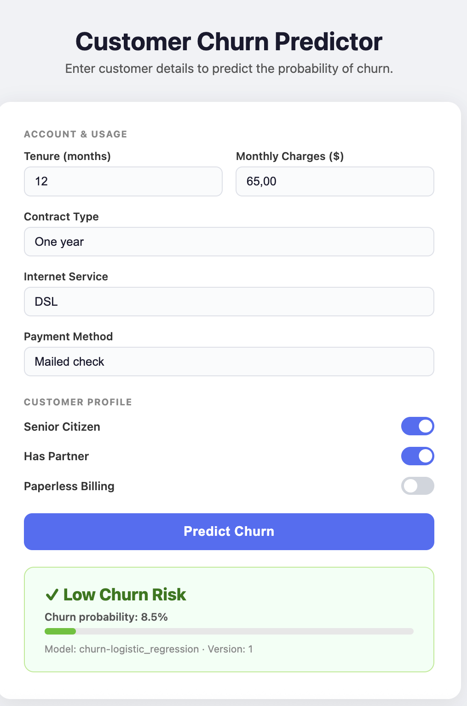

# Customer Churn Prediction — End-to-End ML Pipeline

**Live Demo:** https://customer-churn-prediction-omega-opal.vercel.app
**API Docs (Swagger):** https://customer-churn-prediction-omega-opal.vercel.app/docs

---



---

## What is this project?

This project shows **every step a real ML project goes through** — from raw data to a live production API that anyone can call.

The business problem: predict which telecom customers are about to cancel their subscription (**churn**). If a company knows who is about to leave, they can offer discounts or take action before it happens.

The dataset is the [IBM Telco Customer Churn dataset](https://www.kaggle.com/datasets/blastchar/telco-customer-churn) — 7,043 customers, 20 features, binary target (churn: Yes / No).

---

## What does "end-to-end" mean here?

Most ML tutorials stop at training a model and printing accuracy. This project goes all the way:

```
Raw CSV
  → SQLite database
    → Preprocessing (clean, encode, scale)
      → Train 3 models + track experiments (MLflow)
        → Evaluate against quality thresholds
          → Promote best model as "champion"
            → Export model to bundle
              → Deploy as REST API (Vercel)
                → CI/CD tests run on every push (GitHub Actions)
                  → Frontend UI for non-technical users
```

---

## Key Technologies

| Tool | What it does in this project |
|---|---|
| **scikit-learn** | Trains the ML models (Logistic Regression, Random Forest, Gradient Boosting) |
| **MLflow** | Tracks experiments, stores model versions, manages promotion with aliases |
| **FastAPI** | Serves predictions as a REST API |
| **Vercel** | Hosts the API and frontend in production (serverless, free tier) |
| **GitHub Actions** | Runs automated tests on every push (CI/CD) |
| **SQLite** | Stores the training data as a proper database (not a raw CSV) |
| **pytest** | Automated tests for the API and preprocessing |

---

## Architecture Overview

```
                    ┌──────────────┐
                    │  CSV Dataset │
                    └──────┬───────┘
                           │ setup_db.py
                    ┌──────▼───────┐
                    │ SQLite (DB)  │
                    └──────┬───────┘
                           │ train.py
                    ┌──────▼───────────────────┐
                    │  MLflow Experiment        │
                    │  - random_forest          │
                    │  - gradient_boosting      │
                    │  - logistic_regression    │
                    └──────┬───────────────────┘
                           │ evaluate.py (threshold gate)
                    ┌──────▼───────┐
                    │  @champion   │  ← best model that passed all thresholds
                    └──────┬───────┘
                           │ export_model.py
                    ┌──────▼───────────────────┐
                    │  bundle/                  │
                    │  - model.pkl              │
                    │  - scaler.pkl             │
                    │  - feature_cols.json      │
                    │  - meta.json              │
                    └──────┬───────────────────┘
                           │ git push
              ┌────────────▼────────────────────┐
              │  GitHub Actions (CI)             │
              │  - validates bundle exists       │
              │  - runs 15 automated tests       │
              └────────────┬────────────────────┘
                           │ Vercel auto-deploy
                    ┌──────▼───────┐
                    │  Production  │
                    │  FastAPI     │
                    │  + UI        │
                    └──────────────┘
```

---

## What is MLflow and why does it matter?

> If you have never used MLflow before, here is a quick explanation.

When training ML models, things get messy fast. You try different parameters, different algorithms, and after a week you have no idea which run gave the best result or how to reproduce it.

**MLflow solves this.** Every training run is automatically saved with:
- The exact parameters used (e.g. `n_estimators=100`)
- The metrics (accuracy, F1, ROC-AUC)
- The trained model file
- Artifacts like the feature columns list and scaler

### Model Aliases: @challenger and @champion

Instead of hardcoding a model version number in the API, this project uses **aliases**:

- `@challenger` — a new model under evaluation
- `@champion` — the current best model approved for production

When you train a better model, you run `evaluate.py`. If it passes all quality thresholds, it is automatically promoted to `@champion`. The API always serves whatever is tagged `@champion` — no code changes needed.

```
New training run → @challenger → threshold check → (pass) → @champion → exported to bundle/
```

### Threshold-Gated Promotion

A model is only promoted if it passes ALL three thresholds:

| Metric | Threshold | Why |
|---|---|---|
| Accuracy | ≥ 0.80 | At least 80% of predictions must be correct |
| F1 Score | ≥ 0.55 | Balances precision and recall on the minority class (churners) |
| ROC-AUC | ≥ 0.80 | Measures how well the model separates churners from non-churners |

If any threshold fails, the model is blocked from production. This prevents regressions.

---

## What is CI/CD and how is it set up here?

> CI/CD stands for Continuous Integration / Continuous Deployment.

Every time code is pushed to the `main` branch, **GitHub Actions automatically**:

1. Installs all dependencies
2. Checks that the model bundle files exist (`model.pkl`, `scaler.pkl`, `feature_cols.json`, `meta.json`)
3. Runs all 15 automated tests

If any test fails, the workflow is marked as failed and Vercel does not deploy broken code.

The workflow file is at `.github/workflows/ci.yml`.

There is also a **manual deploy workflow** (`.github/workflows/deploy.yml`) that:
1. Exports the current `@champion` model from MLflow
2. Runs the tests against the new bundle
3. Commits the updated bundle and pushes — which triggers Vercel to redeploy

---

## The Prediction API

**Base URL:** `https://customer-churn-prediction-omega-opal.vercel.app`

| Method | Path | Description |
|---|---|---|
| `GET` | `/` | Frontend UI |
| `GET` | `/health` | Health check |
| `GET` | `/docs` | Interactive API docs (Swagger UI) |
| `POST` | `/predict` | Predict churn probability |
| `GET` | `/api/status` | Model metadata (name, version, alias) |

### Example: Predict churn with curl

```bash
curl -X POST https://customer-churn-prediction-omega-opal.vercel.app/predict \
  -H 'Content-Type: application/json' \
  -d '{
    "features": {
      "tenure": 2,
      "monthlycharges": 95.0,
      "totalcharges": 190.0,
      "contract_Month-to-month": 1,
      "internetservice_Fiber optic": 1,
      "paymentmethod_Electronic check": 1
    }
  }'
```

**Response:**
```json
{
  "churn": true,
  "probability": 0.6821,
  "model_name": "churn-logistic_regression",
  "model_version": "1"
}
```

The API accepts any subset of features. Missing features default to `0`. The full list of 45 feature names is in `bundle/feature_cols.json`.

---

## Model Results

Three models were trained and compared. The best model is automatically selected by evaluate.py:

| Model | Accuracy | F1 | ROC-AUC | Promoted? |
|---|---|---|---|---|
| Random Forest | 0.783 | 0.52 | 0.813 | No |
| Gradient Boosting | 0.796 | 0.58 | 0.839 | No (accuracy below threshold) |
| **Logistic Regression** | **0.804** | **0.61** | **0.836** | **Yes → @champion** |

---

## Project Structure

```
customer_churn_prediction/
├── data/                     # CSV and SQLite database (gitignored)
├── bundle/                   # Exported model artifacts — committed to git for Vercel
│   ├── model.pkl             # Trained model
│   ├── scaler.pkl            # StandardScaler fitted on training data
│   ├── feature_cols.json     # Ordered list of 45 feature column names
│   └── meta.json             # Model metadata (name, alias, version, run_id)
├── frontend/
│   └── index.html            # Simple HTML/JS UI served at GET /
├── src/
│   ├── setup_db.py           # Load CSV into SQLite
│   ├── preprocess.py         # Clean, encode, scale — returns train/test splits
│   ├── train.py              # Train all models + log to MLflow
│   ├── evaluate.py           # Run metrics, check thresholds, assign @champion alias
│   ├── export_model.py       # Download @champion from MLflow → bundle/
│   └── register_model.py     # Manually assign an alias by run ID
├── api/
│   ├── index.py              # FastAPI app — loads from bundle/ (no MLflow at runtime)
│   └── requirements.txt      # Lightweight serving dependencies only
├── tests/
│   ├── test_api.py           # Tests for all API endpoints and bundle validation
│   └── test_preprocess.py    # Tests for the preprocessing pipeline
├── .github/
│   └── workflows/
│       ├── ci.yml            # Runs tests on every push to main
│       └── deploy.yml        # Manual: export champion → test → push bundle → redeploy
├── conftest.py               # pytest path setup
├── vercel.json               # Vercel deployment config
├── .env                      # Local environment variables (gitignored)
└── requirements.txt          # Full development dependencies
```

---

## Running It Yourself

### 1. Install dependencies

```bash
pip install -r requirements.txt
```

### 2. Load the dataset into SQLite

```bash
python3 src/setup_db.py --csv data/WA_Fn-UseC_-Telco-Customer-Churn.csv
```

### 3. Train models

MLflow uses a local SQLite file — no server needed:

```bash
# Make sure .env has: MLFLOW_TRACKING_URI=sqlite:///mlflow.db
python3 src/train.py
```

View results in the MLflow UI:
```bash
mlflow ui --backend-store-uri sqlite:///mlflow.db --port 5000
# Open http://localhost:5000
```

### 4. Evaluate and promote the best model

```bash
python3 src/evaluate.py --model-name churn-logistic_regression --run-id <RUN_ID> --promote
```

### 5. Export champion model to bundle

```bash
python3 src/export_model.py
```

### 6. Run the API locally

```bash
uvicorn api.index:app --reload
# Open http://localhost:8000
```

### 7. Run the tests

```bash
pytest tests/ -v
```

---

## Environment Variables

Copy `.env.example` to `.env` and fill in your values:

| Variable | Description | Default |
|---|---|---|
| `MLFLOW_TRACKING_URI` | MLflow tracking URI | `sqlite:///mlflow.db` |
| `MLFLOW_EXPERIMENT_NAME` | Experiment name in MLflow | `customer-churn` |
| `MLFLOW_MODEL_NAME` | Registered model name | `churn-logistic_regression` |
| `MLFLOW_MODEL_ALIAS` | Alias to export | `champion` |
| `DB_PATH` | Path to SQLite database | `data/churn.db` |
| `DB_TABLE` | Table name | `churn` |
| `TARGET_COL` | Target column name | `churn` |
| `THRESHOLD_ACCURACY` | Minimum accuracy to promote | `0.80` |
| `THRESHOLD_F1` | Minimum F1 score to promote | `0.55` |
| `THRESHOLD_ROC_AUC` | Minimum ROC-AUC to promote | `0.80` |

---

## Key Design Decisions

**Why SQLite instead of a CSV?**
A database enforces schema, supports queries, and is more realistic than reading a raw CSV. For a small dataset like this it is sufficient. In production you would use PostgreSQL or BigQuery.

**Why bundle the model instead of calling MLflow at runtime?**
MLflow is a local development tool here. Vercel (the cloud host) has no access to your local MLflow database. The solution is to export the model files to `bundle/` and commit them to git. Vercel just loads the `.pkl` files directly — no MLflow dependency at runtime.

**Why three separate models?**
To show that model selection is part of the pipeline. The best model is not chosen manually — it is determined by `evaluate.py` against fixed thresholds. The `@champion` alias is reassigned automatically.

**Why apply the StandardScaler separately instead of using a Pipeline?**
The scaler is exported to `bundle/scaler.pkl` and applied in the API. This makes the scaling step explicit and visible, which is easier to understand and debug. A `sklearn.Pipeline` wrapping scaler + model would also work and is a valid alternative.
